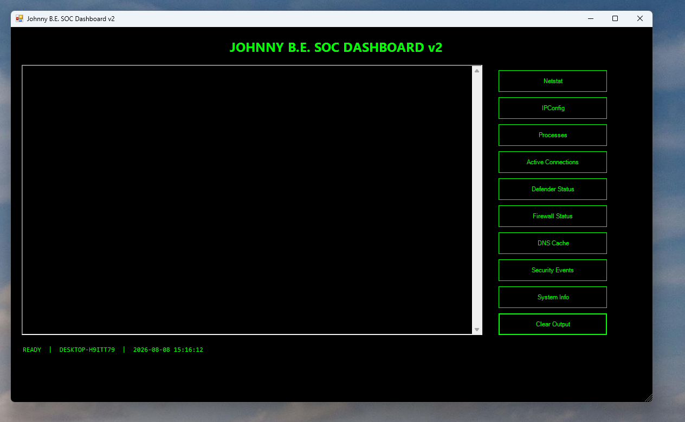

# Johnny B.E. SOC Dashboard

A PowerShell-based Windows security investigation dashboard designed to practice foundational Security Operations Center (SOC) analyst workflows from a single interface.



## Overview

The Johnny B.E. SOC Dashboard is a hands-on cybersecurity project built in PowerShell to bring common Windows investigation commands into one interface.

The project was created as part of my transition into cybersecurity and SOC analysis, with an emphasis on understanding what happens behind security tools rather than simply relying on automated results.

## Features

The dashboard provides quick access to:

- **Netstat** — Review network connections and listening ports
- **IPConfig** — Review IP configuration and network adapter information
- **Processes** — Examine currently running Windows processes
- **Active Connections** — Focus on established network connections
- **Defender Status** — Review Microsoft Defender security status
- **Firewall Status** — Inspect Windows Firewall profiles and status
- **DNS Cache** — Review cached DNS records for investigation
- **Security Events** — Examine recent Windows Security event logs
- **System Info** — Review basic Windows system and host information
- **Clear Output** — Reset the investigation window between queries

## SOC Skills Demonstrated

This project provides hands-on practice with:

- Windows endpoint investigation
- PowerShell scripting
- Network connection analysis
- Process and service enumeration
- Windows Event Logs
- Authentication event analysis
- Microsoft Defender
- Basic incident triage
- Security automation
- SOC investigation workflow

## Screenshot


## Requirements

- Windows 10 or Windows 11
- Windows PowerShell
- Administrator privileges recommended for access to protected security logs

## Running the Dashboard

1. Download or clone this repository.
2. Open PowerShell.
3. Navigate to the project directory.
4. Run:

```powershell
.\JohnnyBSOCDashboard-v2.ps1
```

Some dashboard functions may require PowerShell to be run as Administrator.

## Purpose

This is an educational cybersecurity project intended to strengthen practical SOC analyst skills while learning how Windows, networking, endpoint security, and PowerShell work together during an investigation.

## Future Improvements

Planned improvements include:

- Additional Windows Event ID filtering
- Suspicious process identification
- Network connection enrichment
- Exportable investigation results
- Additional Defender information
- Expanded incident-response functionality

## Author

**John Busuego**

Cybersecurity learner | SOC Analyst pathway | PMP
